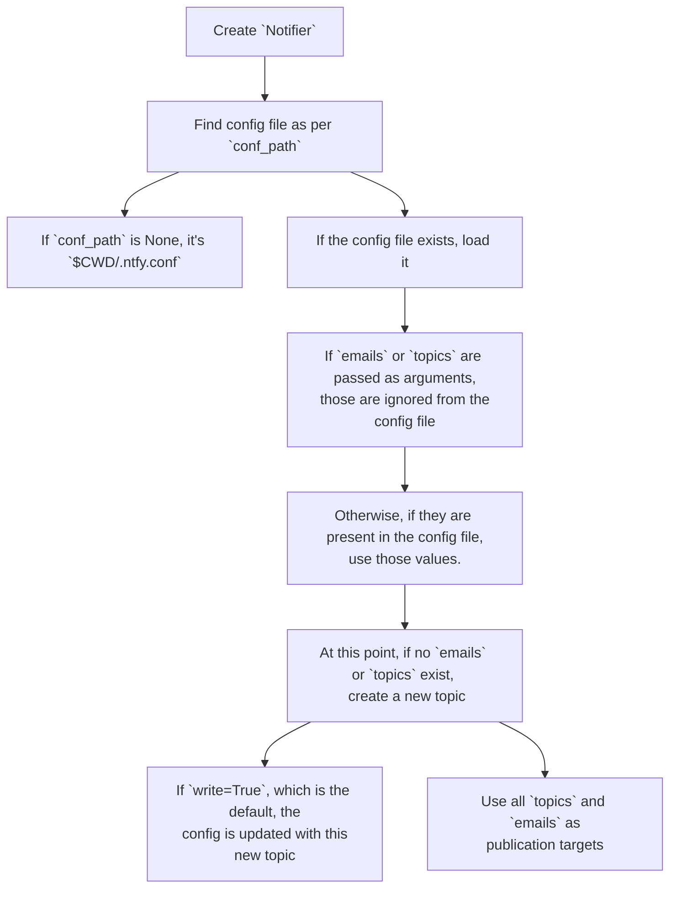
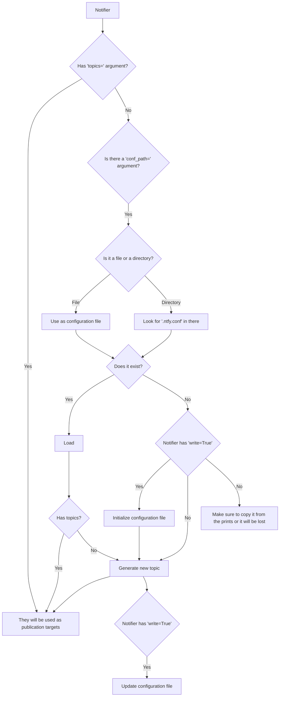

# Flow charts

https://mermaid.live/

```mermaid
flowchart TD
    A[Create `Notifier`] --> B[Find config file as per `conf_path`]
    B --> C[If `conf_path` is None, it's `$CWD/.ntfy.conf`]
    B --> D[If the config file exists, load it]
    D --> E[If `emails` or `topics` are passed as arguments,\n those are ignored from the config file]
    E --> F[Otherwise, if they are present in the config file,\nuse those values.]
    F --> G[At this point, if no `emails` or `topics` exist, \n create a new topic]
    G --> H[If `write=True`, which is the default, the\n config is updated with this new topic]
    G --> I[Use all `topics` and `emails` as\npublication targets]
```

```mermaid
flowchart TD
    A[Notifier] --> B{Has 'topics=' argument?};
    B -- Yes --> C[They will be used as publication targets];
    B -- No --> D{Is there a 'conf_path=' argument?};
    D -- Yes --> E{Is it a file or a directory?};
    E -- File --> F[Use as configuration file];
    E -- Directory --> G[Look for '.ntfy.conf' in there]
    F --> H{Does it exist?}
    G --> H
    H -- Yes --> I[Load]
    H -- No --> J{Notifier has 'write=True'}
    J -- Yes --> K[Initialize configuration file]
    J -- No --> L[Generate new topic]
    J -- No --> Q[Make sure to copy it from the prints or it will be lost]
    I --> N{Has topics?}
    K --> L
    N -- Yes --> C
    N -- No --> L
    L --> C
    L --> O{Notifier has 'write=True'}
    O -- Yes --> P[Update configuration file]
```